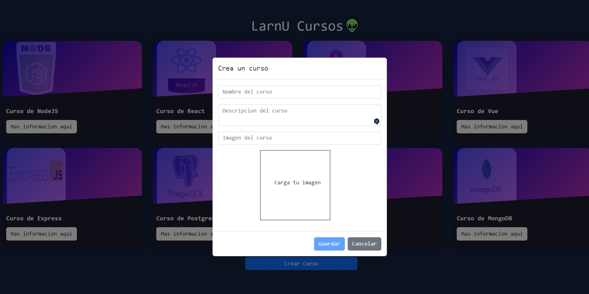

# Cursos App

## Introduccion

Este proyecto fue diseñado para una prueba en donde se desarrollo una SPA, con el fin de poder crear una plataforma de cursos para los usuarios.

## Objetivos del proyecto
Crear un software en una semana, en el cual se deberia poder
listar, eliminar, crear y modificar los cursos.

## Stack de tecnologias

### Front End:
HTML, CSS, Javascript, React, React-Bootstrap, Redux Toolkit

### Back End:
Node.js, Express, Sequelize.

### Database:
PostgreSQL

## **Instrucciones** 

__IMPORTANTE:__ Versiones de Node y NPM

 * __Node__: 12.18.3 o mayor
 * __NPM__: 6.14.16 o mayor

 
## BoilerPlate

El boilerplate tiene dos carpetas principales: `api` y `client`.

Adentro de `api` deberias crear un archivo : `.env` 
en donde tiene que tener lo siguiente: 

```
DB_USER=postgreuser
DB_PASSWORD=postgrepassword
DB_HOST=localhost
DB_NAME=cursos
PORT=3001

```
Adentro de `client` deberias crear un archivo : `.env` 
en donde tiene que tener lo siguiente: 

```
REACT_APP_API=http://localhost:3001

```
Debes reemplazar `postgresuser` y `postgrespassword` con tus propias credenciales para conectarte a la base de datos. Este archivo sera ignorado por Github y tiene informacion sensible(credenciales)


## Luego
### _Conectate a la base de datos_

 - ve a tu consola de postgre y crea una nueva base de datos llamada `cursos`, este es el nombre de la base de datos a la cual te vas a conectar

### _Instala los paquetes necesarios para correr el servidor_

- Abre la consola del proyecto
    + Adentro de la carpeta `api` ,corre el siguiente comando, `npm install`
    + Adentro de la carpeta`client` , corre el siguiente comando, `npm install` 

### _Levanta el proyecto_

- Abre la consola del proyecto
    + Adentro de la carpeta `api`, corre el siguiente comando, `npm start`
        
    + Adentro de la carpeta`client`, corre el siguiente comando, `npm start` (ira hacia http://localhost:3000/) 

# Para el testing db

- Puedes encontrar en `api/index.js`
    + `conn.sync({ force: false })`, cambia entre " true " (si quieres que se recargue la base de datos ) o " false "( si no quieres que se recargue la base de datos ) 

# Imagenes del proyectos

- Pagina Principal
<p align="center">
  
</p>

- Crear un curso
<p align="center">
  
</p>

- Detalles del curso
<p align="center">
  
</p>
